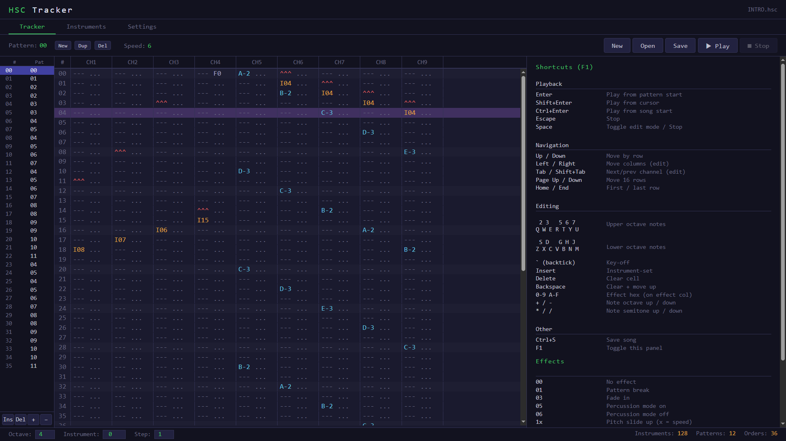

# HSC Tracker - Browser-Based AdLib/OPL2 Music Player

A browser-based player for HSC (AdLib Composer / HSC Tracker) music files.
Emulates a Yamaha YM3812 (OPL2) synthesizer in JavaScript using DBOPL and the Web Audio API.

## Demo

Try it online: https://hsc-tracker-js.dynart.net

Example HSC files for testing are included in the `music/` folder.


## Quick Start

HSC Tracker requires a local HTTP server (AudioWorklet won't work over `file://`):

```bash
# Python
python -m http.server 8000

# Node.js
npx serve .

# PHP
php -S localhost:8000
```

Then open `http://localhost:8000` in your browser.

## Usage

1. Click **Open** or drag & drop an `.hsc` file onto the page
2. Press **Play** or hit **Space** to start playback
3. Press **Stop** or hit **Space** again to stop

## Features

- Full OPL2 (YM3812) emulation via DBOPL in JavaScript
- HSC binary format parsing with AdPlug-compatible bit corrections
- Tick-accurate sequencer at 18.2 Hz (PC timer frequency)
- Pattern display with current-row highlighting and auto-scroll
- Order list visualization
- Per-channel activity level meters
- All HSC effects: pitch slides, volume, speed, pattern break, position jump, feedback
- Dark tracker-aesthetic UI

## Architecture

```
[HSC File] → [HSC Parser] → [HSC Sequencer] → [DBOPL Emulator] → [Web Audio API] → [Speaker]
                                    ↓
                              [UI Visualization]
```

- **HSC Parser** (`js/hsc-parser.js`): Reads the binary HSC format (instruments, order list, patterns)
- **DBOPL** (`js/dbopl.js`): Yamaha YMF262/YM3812 OPL2 emulator (JavaScript port of DOSBox DBOPL)
- **OPL2 Wrapper** (`js/opl2-wrapper.js`): Adapter between DBOPL and the HSC sequencer
- **HSC Sequencer** (`js/hsc-seq.js`): Tick-based playback engine running at 18.2 Hz
- **Audio Worklet** (`js/audio-worklet.js`): AudioWorkletProcessor for glitch-free audio output
- **UI** (`index.html`): Pattern display, controls, and visualization

## HSC Format

The HSC format stores AdLib/OPL2 music with:
- 128 instruments (12 bytes each, mapping to OPL2 registers)
- 51-byte order list (pattern sequence)
- Up to 50 patterns (64 rows × 9 channels × 2 bytes each)

## Browser Compatibility

Requires a modern browser with AudioWorklet support:
- Chrome 66+
- Firefox 76+
- Safari 14.1+
- Edge 79+

## Tech Stack

Vanilla JavaScript + HTML/CSS. No frameworks, no build tools, no dependencies.

## File Structure

```
hsc-tracker/
├── index.html           # Main page with inline CSS and UI logic
├── js/
│   ├── hsc-parser.js    # HSC binary format parser
│   ├── dbopl.js         # OPL2 emulator (DOSBox DBOPL port)
│   ├── opl2-wrapper.js  # DBOPL adapter for the sequencer
│   ├── hsc-seq.js       # Tick-based playback engine
│   └── audio-worklet.js # AudioWorkletProcessor entry point
├── music/               # Example HSC files for testing
└── README.md
```

## License

Part of the DOS Game Engine project.
OPL2 emulation uses DBOPL, a JavaScript port of the DOSBox OPL emulator.

- [Original DBOPL (C++)](https://sourceforge.net/p/dosbox/code-0/HEAD/tree/dosbox/trunk/src/hardware/dbopl.cpp) - DOSBox Team
- [TypeScript port](https://github.com/tomsoftware/DBOPL) - Thomas Zeugner
