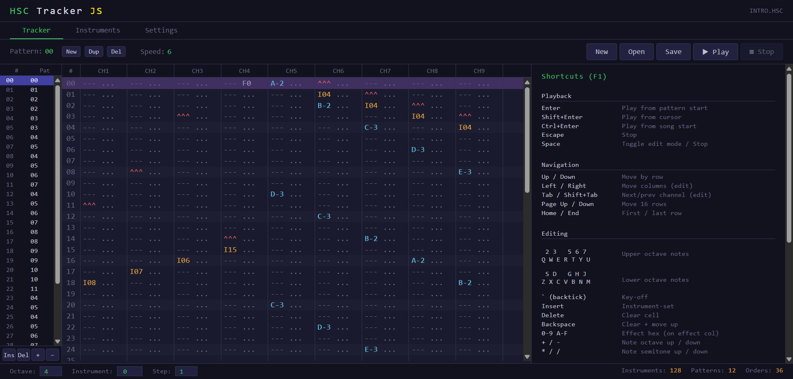

# HSC Tracker JS

A browser-based tracker and player for HSC (AdLib Composer / HSC Tracker) music files.
Emulates a Yamaha YM3812 (OPL2) synthesizer in JavaScript using DBOPL and the Web Audio API.

## Demo

Try it online: https://hsc-tracker-js.dynart.net

Example HSC files for testing are included in the `music/` folder.


## Quick Start

HSC Tracker JS requires a local HTTP server (AudioWorklet won't work over `file://`):

```bash
# Python
python -m http.server 8000

# Node.js
npx serve .

# PHP
php -S localhost:8000
```

Then open `http://localhost:8000` in your browser.

## Usage

1. The tracker starts with an empty song, or click **Open** / drag & drop an `.hsc` file
2. Press **Space** to enter edit mode, use piano keys to enter notes
3. Press **Enter** to play, **Escape** to stop
4. Switch to the **Instruments** tab to edit instrument parameters
5. Press **Ctrl+S** to save your work

## Features

### Tracker
- Full pattern editor with cursor navigation and edit mode
- Note entry via piano keyboard layout (two octaves) or MIDI keyboard
- Effect entry with hex digits
- Key-off, instrument-set, delete/backspace commands
- Note manipulation: octave shift (+/-), semitone shift (\*//)
- Configurable edit step
- FT2-style vertical order list with Insert/Delete/+/- controls
- Pattern management: create, duplicate, delete patterns
- Note preview with correct instrument per channel
- Instrument-aware play-from-position

### Instrument Editor
- Carrier/Modulator parameter controls (ADSR, level, multiplier, KSL)
- Live ADSR envelope visualization
- Waveform visual selector
- Feedback, FM/AM connection, fine-tune
- Tremolo, vibrato, sustain, KSR toggles
- Polyphonic note preview with channel rotation
- Load/Save single instruments in INS format (Electronic Rats)
- Copy/paste instruments (Ctrl+C/V)

### MIDI
- MIDI keyboard input (enable in Settings > MIDI)
- Polyphonic instrument preview with channel rotation
- Direct note entry in edit mode with absolute pitch mapping
- MIDI device selector with hot-plug detection

### Playback
- Full OPL2 (YM3812) emulation via DBOPL
- Tick-accurate sequencer at 18.2 Hz (PC timer frequency)
- Play from pattern start (Enter), cursor position (Shift+Enter), or song start (Ctrl+Enter)
- Channel header blink on note triggers
- All HSC effects: pitch slides, volume, speed, pattern break, position jump, feedback

### File I/O
- HSC binary format load/save
- INS instrument format load/save
- Drag & drop file loading
- New song creation

### Settings
- Blink effect on note (channel header animation)
- Help panel visibility (F1 to toggle)
- QWERTZ keyboard layout support
- MIDI input enable/disable and device selection

## Keyboard Shortcuts

| Key | Action |
|-----|--------|
| Space | Toggle edit mode / Stop playback |
| Enter | Play from pattern start |
| Shift+Enter | Play from cursor position |
| Ctrl+Enter | Play from song start |
| Escape | Stop playback |
| Arrows | Navigate pattern (Up/Down = rows, Left/Right = columns in edit mode) |
| Tab / Shift+Tab | Next/previous channel (edit mode) |
| Page Up/Down | Move 16 rows |
| Home / End | First / last row |
| Z-M / Q-U | Piano keys (lower/upper octave) |
| Backtick | Key-off / Stop preview |
| Insert | Instrument-set command |
| Delete | Clear cell |
| Backspace | Clear cell + move up |
| + / - | Shift note octave up/down |
| \* / / | Shift note semitone up/down |
| Ctrl+S | Save song |
| Ctrl+C / Ctrl+V | Copy/paste instrument (Instruments tab) |
| F1 | Toggle shortcuts panel |

## Architecture

```
[HSC File] -> [HSC Parser] -> [HSC Sequencer] -> [DBOPL Emulator] -> [Web Audio API] -> [Speaker]
                                     |
                               [UI / Editor]
```

- **HSC Parser** (`js/hsc-parser.js`): Reads the binary HSC format (instruments, order list, patterns)
- **DBOPL** (`js/dbopl.js`): Yamaha YMF262/YM3812 OPL2 emulator (JavaScript port of DOSBox DBOPL)
- **OPL2 Wrapper** (`js/opl2-wrapper.js`): Adapter between DBOPL and the HSC sequencer
- **HSC Sequencer** (`js/hsc-seq.js`): Tick-based playback engine running at 18.2 Hz
- **Audio Worklet** (`js/audio-worklet.js`): AudioWorkletProcessor for glitch-free audio output
- **UI** (`index.html`): Tracker editor, instrument editor, settings, and visualization

## HSC Format

The HSC format stores AdLib/OPL2 music with:
- 128 instruments (12 bytes each, mapping to OPL2 registers)
- 51-byte order list (pattern sequence)
- Up to 50 patterns (64 rows x 9 channels x 2 bytes each)

## INS Format

The INS instrument format (Electronic Rats / Hannes Seifert):
- 12 bytes, no header
- Same byte layout as HSC instrument data
- Load/save single instruments for reuse across songs

## Browser Compatibility

Requires a modern browser with AudioWorklet support:
- Chrome 66+
- Firefox 76+
- Safari 14.1+
- Edge 79+

## Tech Stack

Vanilla JavaScript + HTML/CSS. No frameworks, no build tools, no dependencies.

## File Structure

```
hsc-tracker-js/
├── index.html           # Main page with tracker editor, instruments, settings
├── js/
│   ├── hsc-parser.js    # HSC binary format parser
│   ├── dbopl.js         # OPL2 emulator (DOSBox DBOPL port)
│   ├── opl2-wrapper.js  # DBOPL adapter for the sequencer
│   ├── hsc-seq.js       # Tick-based playback engine
│   └── audio-worklet.js # AudioWorkletProcessor entry point
├── images/              # Screenshots and waveform SVGs
├── music/               # Example HSC files for testing
├── CHANGELOG.md         # Version history
└── README.md
```

## Credits

The example music are from the original [HSC Tracker](https://www.pouet.net/prod.php?which=64313)

OPL2 emulation uses DBOPL, a JavaScript port of the DOSBox OPL emulator.

- [Original DBOPL (C++)](https://sourceforge.net/p/dosbox/code-0/HEAD/tree/dosbox/trunk/src/hardware/dbopl.cpp) - DOSBox Team
- [TypeScript port](https://github.com/tomsoftware/DBOPL) - Thomas Zeugner